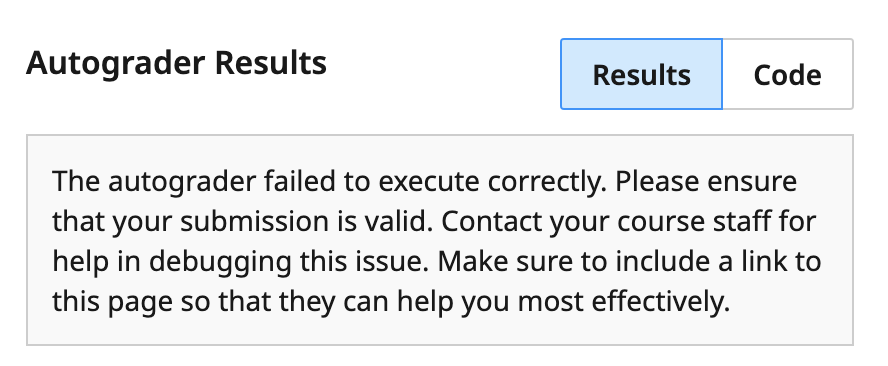
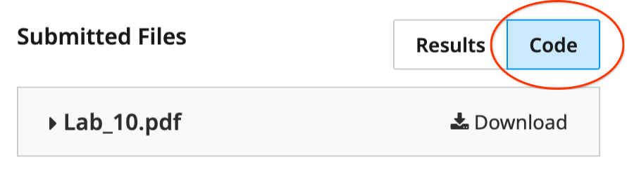

# Gradescope debug guide

This guide walks you through common pitfalls that cause the autograder to crash:

The purpose of the autograder is to help you. It provides guidance through test case failures, it offers guardrails to confirm you've followed directions correctly, and when it crashes or fails, it can be an indicator to you that something is not quite right with what you are doing and that it would be beneficial to have a conversation with a course staff member. 

Yes, the autograder may be frustrating at times to deal with, but with the ability to resubmit as many times as you like before the deadline, rather it can give you feedback early while you still have time to course correct and give you the opportunity to earn the assignment points and to learn the material. It is better that you are able to receive feedback on-demand, which would otherwise not be possible at all in a large 200+ person class.

In industry, similar systems are used to ensure that code you have written integrates well with other people's code, that correctness tests remain passing with your code submission, and that the requirements of your deliverables have been fulfilled according to the specifications.

## Review submitted files

Click on the "Code" button to double check what files you have submitted. Ensure that you have submitted the necessary files listed in the lab spec.

Check the name of the file. Make sure it has not been modified from what it was called in the starter zip file (if provided), and that it matches the name required in the lab spec. Captilization and spelling must match exactly!

You can expand the file contents to ensure you have submitted the correct version of the file as well. Maybe you accidentally submitted an unintended copy of the same name stored elsewhere on your computer?

Below is an example, where we've accidentally submitted a completely unrelated PDF file, when we should have submitted our java code file.

## Does the code compile?

If your code does not compile, the autograder code will not be able to use it. Always compile, run, and test your code locally on your machine before submitting to Gradescope, as this is much faster than waiting for the autograder results and is better practice.

1. Save the file.

2. Compile `Foo.java`:

	javac Foo.java

3. Run:

	java Foo

## Naming and starter code deviations

If starter code was provided, ensure that the following are not changed in any way:

- File name
- Name of the class: `public class `...
- Method signatures: `public static int foo(int x, int y)`

For anything you were asked to add in the spec, make sure that any naming is followed exactly as given in the spec. The examples are provided to emphasize the naming must match.

As an example, if you were asked to create a method called `multiply`, then you must call it `multiply` and you may not call it `mult` or any other name. The autograder tests your code by calling upon a method it expects to be called `multiply`; if you've named it something else, the autograder would not know that and thus it would crash because `multiply` does not exist in your solution.

## Ask for help

If you're facing autograder issues that you don't know how to resolve, it can be a helpful nudge to you to talk to your friendly TA/IA/Googler who can help you understand what is wrong. They will for sure be able to clarify for you any misunderstanding or differing interpretations of concepts or requirements which may cause the issue, and can help you avoid any pitfalls in the future!

Best practices:

- Start early! Issues raised prior to the deadline can definitely be solved in time. Issues raised hours before a deadline may not be seen or addressed in time, or there may be too many such messages for the course staff member to respond to all in time.
- Send an email or visit office hours! View the [office hours schedule here](office-hours).
- When sending an email, include the URL of your Gradescope submission page. It should look something like `https://www.gradescope.com/courses/123/assignments/456/submissions/789`. Also include what steps you have tried and what the result of those steps were.
