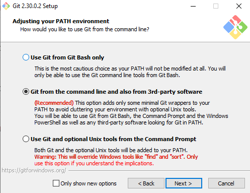
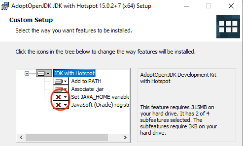

# Lab 0: Setup and Hello World!
{:.no_toc}

Welcome to your first CS 1 lab! In this lab we will be completing setup steps needed so that you can use your personal computer for coursework. In the end, you will run your first Java program and submit the code for grading.

{: .note }
Going through setup can be tricky! Please make sure to carefully read each section to ensure steps aren't being skipped. If there are error messages or if the outcome of a step does not match what it says here, please don't hesitate to flag down a TA/IA for help.

## Table of contents
{: .no_toc .text-delta }

1. TOC
{:toc}

## Text editor installation

First we will need a text editor, which will enable you to type out your Java programs. Text editors you may have used for English essays include Microsoft Word, Google Docs, notepad, etc. While these could be used for coding as well, there are text editors specifically designed for coding which will provide more relevant features such as coloring of different pieces of code, auto-completion of common code, and more.

We will use the [Sublime Text](https://www.sublimetext.com/) text editor in this course. Go to the website and download/install it to your machine.

## Terminal setup

Next you will need a terimal. Like in the movies, programmers can use the terminal to issue typed-out commands to the computer.

{: .warning }
There are many powerful commands, including some with the ability to permanently delete entire folders from your computer, mess with settings, or install and execute unwanted malware. Thus, do not run commands found on the internet without fully understanding them first!

### Mac users

Macs come with terminal already. Open spotlight search (Cmd + Space) and type "Terminal".

### Windows users

We will use GitBash.

1. Download the [Git for Windows installer](http://git-scm.com/download/).

	

2. Run the installer and click Next until reaching the "Select Components" screen. Uncheck/check the options to match what is shown below.

	

3. Click Next on the next few screens until reaching "Adjust your PATH environment". Select the middle, recommended option as shown below.

	

4. Click Next for the remaining screens and finish the installation.


## Java installation

### Mac users

1. Follow the instructions on the [Oracle website](https://docs.oracle.com/en/java/javase/20/install/installation-jdk-macos.html#GUID-F575EB4A-70D3-4AB4-A20E-DBE95171AB5F) for "Installing the JDK on macOS".

	On the download screen, select `JDK 20` and `macOS`. And then for Macs with...
	- M1 or M2 processors, download the `ARM64 DMG Installer`.
	- Intel processors, download the `x64 DMG Installer`.

	{: .tip }
	If you're not sure which processor you have, you can find out in the Apple menu in the top left corner > About This Mac. See this [Apple help article](https://support.apple.com/en-us/HT211814) for more details.

	

2. Finally, test that Java installed properly by running the following in your terminal:

	```shell
	java -version
	```

	You should see an output similar to:
	 
	

### Windows users

1. Download the pre-built Java from [Adoptium](https://adoptium.net/temurin/releases/?version=20) (version 20). Select the downloadable for `Windows`, `x64`, `.msi`.

2. Run the installer.

	**Important:** The installer will give you the following four options:
	

	You should click the small red Xs and change it from “Entire feature will be unavailable” to “Will be installed on local hard drive” as shown below:

	

	When you’ve done this, it should look like the following:

	
	
	Click next until everything is installed.

3. Check that it is installed properly by running the following in your terminal:

	```shell
	javac --version
	```

	You should see a message indicating javac version `20.0.2+9` or higher.

## Hello World

We will now compile and run your first Java program! By tradition, we will create a program that displays "hello world" to the screen.

1. Create a folder on your computer for your coursework (call it `cs1`). Create another folder inside of it called `lab0`.

2. Create a new file inside the `lab0` folder called `Main.java`.

3. Open this file in Sublime.

4. Paste the following contents into the file and save it.

	```java
	class Main {
		public static void main(String[] args) {
			System.out.println("hello world");
		}
	}
	```

5. Open the terminal such that it is at the `lab0` directory. This can be done by opening your `cs1` folder and right-clicking (or Ctrl + click) on the `lab0` folder and selecting...

	- on Mac, select `New Terminal at Folder`.
	- on Windows, select `Git Bash Here`.

	The path to the `lab0` directory should be visible before your cursor in the terminal window that opens.

	

6. All Java programs need to be **COMPILED** before being **RUN**.

	Compile the program:

	```shell
	javac Main.java
	```

	Run the program (note that there is no `.java` here!):

	```shell
	java Main
	```

	You should see `hello world` displayed as a result.

## Submission setup on Gradescope

Lab assignments will be submitted on Gradescope. Navigate to [gradescope.com](https://www.gradescope.com/) and "Log In" using your UTEP school credentials.


You should be automatically enrolled into a course corresponding to the lab section you are enrolled in on Blackboard.

Open up the "Lab 0" assignment and submit by uploading your `Main.java` file. The autograder will automatically trigger and test your code, and should give you full credit if everything was done correctly. If not, you may resubmit until you receive full credit prior to the deadline set on Gradescope.


Congratulations! You have completed your first lab assignment!

## Grading criteria

| **Criteria**    | **Pts**   |
|:----------------|----------:|
| Autograder test |       100 |
| **_Total_**     | **_100_** |

The deadline is as posted on Gradescope.
Assignments will be accepted up to three days late (72 hours) and will have scores reduced by 10% for each day (24 hours) of tardiness.

---
_Some setup instructions adapted from [UC Berkeley CS 61B data structures course, lab 1, Spring 23](https://sp23.datastructur.es/materials/lab/lab01/)._
