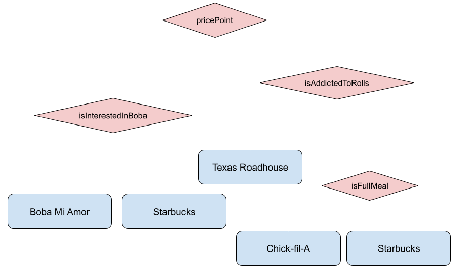

# Lab 2: Conditionals
{:.no_toc}

Today we will be working with conditionals (`if` statements). For today's exercises, first you will start with a **worksheet** distributed by your TA (which you should submit by the end of the lab session) and then there will be a **coding exercise** as well.

Learning objectives:
- understand and practice propositional logic (boolean) and conditional statements.
- testing and debugging.

## Table of contents
{: .no_toc .text-delta }

1. TOC
{:toc}

## Before you begin

Download the starter code zip file, unzip it, and place the contents in `cs1` under a new `lab2` directory. Open it in Sublime.

<a href="https://github.com/UTEP-CS-1/website/raw/main{{page.url|relative_url}}../lab02_starter.zip" class="btn btn-green">Download starter code</a>


Your submission will be scored based upon:
- The code compiles and runs.
- Correctly following the instructions and completing the code accordingly.
- Variables should be given descriptive names. Variable names should be written in camel case (all letters lowercase except the first letter of each word besides the first word), whichIsLikeThis.

## Worksheet

Please start with the worksheet first. When you get to Q2 on the worksheet, a copy of the code is available in the starter code zip file above and is called `BurgerShop.java`.

## Coding exercise: Miners food recommendation service

Nothing keeps you going as a student better than some food, whether it is before, between, or after classes! But sometimes it can be hard to decide where to go for food. To solve this problem, today we will create a recommendation service to help our fellow Miners decide where to eat! All they have to do is answer a few questions, and our code will tell them which food option is the best for them!

After extensive research, we have identified 4 popular food establishments that we would like to recommend and 4 key questions (labelled `A`/`B`/`C`/`D` shown in the red diamonds below) that should be asked. Below, we've organized our food establishments based upon what should be recommended according to the answers to these questions. 



For example:

- Boba Mi Amor should be recommended when the user responds:
    - To question `A` with a value that is `< 10` and to question `B` with the answer `true`. (questions `C` and `D` can have any answer.)
- Starbucks should be recommended when the user responds with EITHER of the following:
    - `A < 10` and `B` is `false`. (`C` and `D` any answer.)
    - `A >= 10`, `C` is `false`, and `D` is `false`. (`B` any answer.)

Open `MinersFoodRecommendationService.java` and add nested `if` statements to implement this logic. Exactly one restaurant name should be outputted each time the program is run, based upon the answers received from the user input on the terminal. Do not use any compound boolean expressions (such as `X && Y` or `X || Y`).

### Optional challenge

_This question is an optional challenge. You can still receive full credit on the lab assignment if you skip it, but if you are finished early, you should give it a try! Not worth extra credit._ 

Open `Challenge.java` and implement the same logic, but you may only replace where it says `/*FIXME*/` in the starter code; you may not add additional `if` statements or clauses or any other lines of code. Ensure that the boolean conditions you fill-in do not perform any redundant checks. You will need to use compound boolean expressions.

An example of a redundant check that you should avoid would be:
```java
if (x) {
    ...
} else if (!x) {
    // !x is redundant since this condition will only
    // be checked when the first `if` condition did not evaluate to `true`.
    ...
}
```

## Submit

Turn in your completed worksheet to your TA before the end of your lab session.

Upload your code file(s) to the Lab 2 assignment on Gradescope.

- `MinersFoodRecommendationService.java` is required.
- You may additionally submit `Challenge.java` for feedback on what you have if you chose to attempt it. (You can drag and drop a second file on the upload screen.)
- `BurgerShop.java` does not need to be submitted.

The autograder will run some simple checks to guide you towards the right track. However, these preliminary checks may not be comprehensive; making all the test cases turn green does not imply that your code is 100% correct. You may resubmit as many times as you like prior to the deadline posted on Gradescope to improve your submission. After the deadline, your active submission will be further graded by a course staff member and/or additional autograder test cases.

## Grading criteria

| **Criteria**                             |   **Pts** |
|:-----------------------------------------|----------:|
| Worksheet                                |        60 |
| Coding exercise correctness              |        30 |
| Coding exercise code style and formatting|        10 |
| Optional challenge                       |         0 |
| **_Total_**                              | **_100_** |

The deadline is as posted on Gradescope.
Assignments will be accepted up to three days late (72 hours) and will have scores reduced by 10% for each day (24 hours) of tardiness.
