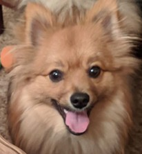
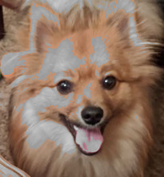
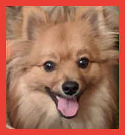
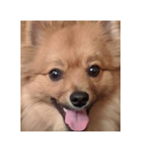
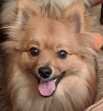

# Comprehensive Lab 2: Image filters
{:.no_toc}

## Table of contents
{: .no_toc .text-delta }

- TOC
{:toc}

{: .important }
Before you get started, read this entire document. If anything is unclear, do not
hesitate to come to your instructor, TAs, IAs, and Googlers for help or clarification. We will be happy to help
you. The office hours schedule is posted on the lab website and Blackboard.

{: .warning }
> Generative AI use is prohibited. Plagiarism detection analysis will be performed on all submissions. Please review the course syllabus for the full standards of conduct. Below is an exerpt on the definition of collaboration.
>
> The following are not allowed:
> - Posting any assignment (or any of its parts) online in any form
> - Sharing assignments outside of the course (i.e., to other students)
> - Copy/pasting any code from anywhere other than from Instructor/TA/IA. This includes copy/pasting code snippets (or entire assignments) from online resources such as, but not limited to: stackoverflow.com, Chegg, Course Hero, ChatGPT/Bard.
> - Sharing your code with other students.
> - Reading code from other students.
> - Look at another student’s code
> - Debug another student’s code
>
> The following are allowed:
> - Communicating with the instructors/TAs/IAs/Googlers
> - Searching for basic syntax online
> - Using examples from reference materials (slides, practice problems, etc.) distributed by your instructor/TA/IA
>
> When in doubt, ask. It is better to ask if something is permitted, rather than doing something that is not permitted and causing issues later.


## Deliverables

- Check-in meeting: you will demonstrate progress towards milestones during an upcoming lab day. Details to be announced.
- Final demo meeting: you will be emailed an assigned appointment time in which you will demonstrate the full functionality of your completed project to a TA, IA, or Googler, and answer questions about the code.
- Code submission on Gradescope: a single file containing all your code, called `Filters.java`, with the class inside named as `Filters`.

Code submission will be accepted up to three days late (72 hours) and will have scores reduced by 10% for each day (24 hours) of tardiness.

## Objective

Students will be able to use their problem solving skills by implementing various image filters using methods, arrays, loops, etc.

## Overview

You will implement several methods, each of which applies a filter effect on an image (such as turning a color image into grayscale). The method headers are defined in `Filters.java`, ready for you to fill-in.

There is also a `Utilities.java` file containing helpful methods that you will need to call upon in `Filters.java`. However, do not modify or submit `Utilities.java`. To call the methods from this other file, write `Utilities.getRGBArray(`...`)`, for example.

<a href="https://github.com/UTEP-CS-1/website/raw/main{{page.url|relative_url}}../clab2_starter.zip" class="btn btn-green">Download corpus.csv file</a>

## Background

**What is an image?** An image is made of square pixels.

Each pixel has single color encoded as 3 RGB values, where R = red, G = green, and B = blue. Each value represents brightness for that color (red, green, or blue) and these values range from 0-255. You can set RGB values to make any color! Try out the [color picker on Google](https://g.co/kgs/VRGV5W)!

For example, here's a close-up of the pixels that make up a scene from the Pixar movie Monsters Inc. and the pixels that make up a picture of a dog:


In an image each pixel has x and y coordinates in the image. The origin (0,0) is at the upper-left corner. y increases going down, x increases going right. This coordinate system in the following code we'll be using to work with images using java will be read an image into a 2D array. 


## Filters

Implement each of the filters described below in the corresponding "apply" method definition in `Filters.java`.

We will use Java's File, ImageIO, BufferedImage libraries to help us read in an image. This section of the code is already done for you as an example in the `main` method, but it's good for you to look through and understand what is going on. You should modify this `main` method code to help you test your filters.

We'll be reading our images into a BufferedImage class. Once we the image stored in the img variable, it's time for us to find the dimensions of the image. For this we will create two integer variable width and height and use the getWidth() and getHeight() method to get the width and height of the image respectively. You'll need the width and height of the image to help you iterate over each pixel.

You are also provided with two methods in `Utilities.java`:

1. getRGBArray when provided with the x and y coordinates of the pixel that you want and the image you want to pull the pixel from will return an array of length 3 [R, G, B]. This array will have the RGB values for that pixel. 

	`getRGBArray(int x, int y, BufferedImage img)`

	Call it in `Filters.java` like this: `Utilities.getRGBArray(x, y, img);`


2. setRGB when provided with an array of length 3 [R, G, B] , the x and y coordinates of the pixel that you want to set and the image you want to set the pixel of will update that pixel in that image with the [R, G, B] color you provided.

	`setRGB(int[] rgb, int x, int y, BufferedImage img)`


### Grayscale
Converting a color image into grayscale image involves repeating 3 steps for each pixel of the image.

1. Get the RGB value of the pixel.

2. Find the average of the R, G, and B values: $\frac{R+G+B}{3}$

3. Replace the R, G, and B value of the pixel with the average calculated in step 2.

Implement this in `Filters.java` inside of

```java
public static void applyGrayscale(BufferedImage img) {
	...
}
```

Test your implementation by calling upon the method from the `main` method.

```java
// Read in the image file.
File f = new File("dog.png");
BufferedImage img = ImageIO.read(f);

// Apply the grayscale implementation on img.
applyGrayscale(img);

// Write the result to a new image file.
f = new File("dog_filtered.png");
ImageIO.write(img, "png", f);
```

You should receive these same before and after results:

 

{: .tip }
You'll need to use nested loops for this and most of the filters to traverse the image.

To debug when your result image does not look right, you can print out pixel values to check the math carried out by your code. For example:

```java
System.out.println("Before:");
System.out.println(Utilities.getRGBArray(0, 0, img)[0]);
System.out.println(Utilities.getRGBArray(0, 0, img)[1]);
System.out.println(Utilities.getRGBArray(0, 0, img)[2]);
// 93 43 47

applyGrayscale(img);

System.out.println("After:");
System.out.println(Utilities.getRGBArray(0, 0, img)[0]);
System.out.println(Utilities.getRGBArray(0, 0, img)[1]);
System.out.println(Utilities.getRGBArray(0, 0, img)[2]);
// 58 58 58
```

### Norak

In this problem, we are going to create a new image filter called the Narok Filter. 

Recall that a pixel can be represented by 3 integers between 0 and 255, representing its red, green and blue components. A pixel's 'average component' is just the average of its red, green and blue components, which can be calculated by adding them all together and dividing by 3. 

The idea behind the Narok filter is to replace each bright pixel in an image with its grayscale equivalent. A bright pixel in an image is defined as a pixel whose average component is greater than 153 (which is 60% of 255). All non-bright pixels in the image should remain unchanged. 

To make a pixel grayscale, simply set each of its red, green and blue components to be equal to its average component. 

Implement this in `Filters.java` inside of

```java
public static void applyNorak(BufferedImage img) {
	...
}
```

 

### Border

Next, we will create a method that will add a border. Both border thickness and border color can be configurable by the parameters.

Border thickness will be a non-negative integer (0, 1, 2, etc.) and corresponds to how many pixels thick the border should be on all four sides inside the perimeter of the image.

Border color is a length 3 integer array, correspond to the RGB color value that the border should be.

Implement this in `Filters.java` inside of

```java
public static void applyBorder(
	BufferedImage img, 
	int borderThickness, 
	int[] borderColor) {
	...
}
```

This is with a border of thickness 10 and RGB values 235, 64, 52:

 

This is with a border of thickness 30 and RGB values 0, 0, 0:

 

### Mirror

Until now we've re-colored pixels in place, but what if we try to move them around? Here you should try to mirror an image horizontally (flip it left to right).

Implement this in `Filters.java` inside of

```java
public static void applyMirror(BufferedImage img) {
	...
}
```

 

{: .tip }
You will need to use an additional variable to temporarily store a pixel value to help you "swap" two pixels.

### Blur

We will now create a filter to blur an image. For each color channel (Red, Green, and Blue) and for each pixel in the image:

1. Get the color channel value of the pixel, as well as those of the 8 pixels surrounding it (1 left, 1 right, 1 up, 1 down, 1 up+left, 1 up+right, 1 down+left, 1 down+right).

2. Find the average of these 9 values.

3. Replace that center pixel's channel value with the average.

{: .note }
For pixels that are not completely surrounded by 8 neighbors, you can leave them unchanged (i.e. start with row 1 instead of row 0 of the image).

Implement this in `Filters.java` inside of

```java
public static void applyBlur(BufferedImage img) {
	...
}
```

 


### Custom
Design and implement your own image filter!

Implement this in `Filters.java` inside of

```java
public static void applyCustom(BufferedImage img) {
	...
}
```

## FAQ

This section will be updated with answers to Frequently Asked Questions as they arise.

(none yet)

