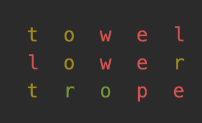

# Comprehensive Lab 3: Wordle
{:.no_toc}

## Table of contents
{: .no_toc .text-delta }

- TOC
{:toc}

{: .important }
Before you get started, read this entire document. If anything is unclear, do not
hesitate to come to your instructor, TAs, IAs, and Googlers for help or clarification. We will be happy to help
you. The office hours schedule is posted on the lab website and Blackboard.

{: .warning }
> Generative AI use is prohibited. Plagiarism detection analysis will be performed on all submissions. Please review the course syllabus for the full standards of conduct. Below is an exerpt on the definition of collaboration.
>
> The following are not allowed:
> - Posting any assignment (or any of its parts) online in any form
> - Sharing assignments outside of the course (i.e., to other students)
> - Copy/pasting any code from anywhere other than from Instructor/TA/IA. This includes copy/pasting code snippets (or entire assignments) from online resources such as, but not limited to: stackoverflow.com, Chegg, Course Hero, ChatGPT/Bard.
> - Sharing your code with other students.
> - Reading code from other students.
> - Look at another student’s code
> - Debug another student’s code
>
> The following are allowed:
> - Communicating with the instructors/TAs/IAs/Googlers
> - Searching for basic syntax online
> - Using examples from reference materials (slides, practice problems, etc.) distributed by your instructor/TA/IA
>
> When in doubt, ask. It is better to ask if something is permitted, rather than doing something that is not permitted and causing issues later.


## Deliverables

- Check-in **submission**: By the check-in deadline posted on Gradescope, submit your progress on the project so far to the designated "Comprehensive Lab 3 CHECK-IN" assignment. See the [Gradescope debugging guide](../../../gradescope-debug-guide) for tips.
- Final demo meeting: this will be the same as for the previous Comprehensive Labs. There will be an announcement posted with a Calendly link where you will need to sign up for an appointment time in which you will demonstrate the full functionality of your completed project to a Googler and answer questions about the code.
- Final code submission on Gradescope.

Check-in code submission and the final code submission will be accepted up to three days late (72 hours) and will have scores reduced by 10% for each day (24 hours) of tardiness.

## Objective

Students will demonstrate all skills learned in CS 1.

## Overview

We will be implementing the Wordle game. Before you begin, familiarize yourself with how to play [Wordle](https://www.nytimes.com/games/wordle/index.html).

The starter code contains several Java files you will need to modify, as well as txt files containing data you will need to parse into your program.

<a href="https://github.com/UTEP-CS-1/website/raw/main{{page.url|relative_url}}../clab3_starter.zip" class="btn btn-green">Download starter code</a>

## WordBank

The `WordBank` class will provide utilities that take care of scanning our word lists to provide any necessary information our word-based game will need. In `WordBank.java`, implement the following methods as described below.

{: .important }
Do not change the names or method signatures given by the starter code, as the autograder will not be able to grade your submission. In particular, do not change the file name (`WordBank.java`), the class name (`WordBank`), or the method signatures provided.

{: .important }
Do not hardcode items from the word lists into your code (i.e. do not copy+paste words from the txt files into your Java file). Your code should function properly even if new words are added or words are removed from the txt files.

{: .tip }
Test these functions by calling them with some sample arguments and `System.out.println` the results. We have provided `Tester.java`  with a main method that you can modify to add print statements to test your code.

### checkInDictionary

The provided method signature is:

```java
public static boolean checkInDictionary(String proposed) throws FileNotFoundException { ... }
```

Implement the method such that it returns whether `proposed` is one of the words in the file `dictionary.txt`.

Examples:

- `WordBank.checkInDictionary("hello")` returns `true`.
- `WordBank.checkInDictionary("asdfg")` returns `false`.

{: .note }
This method will be used to only allow Wordle guesses that are real words.

{: .tip }
Before moving on, check your implementation using `Tester.java`.

### getAnswerForPuzzleNumber

The provided method signature is:

```java
public static String getAnswerForPuzzleNumber(int puzzleNumber) throws FileNotFoundException {
```

Implement the method such that it returns the `puzzleNumber`th word in the file `answers.txt`.

Examples:

- `WordBank.getAnswerForPuzzleNumber(0)` returns `bused`.
- `WordBank.getAnswerForPuzzleNumber(0)` again still returns `bused`.
- `WordBank.getAnswerForPuzzleNumber(1)` returns `plumb`.

You may assume that $$0 \le$$ `puzzleNumber` $$<$$ the number of lines (words) in `answers.txt`.

{: .note }
This method will be used to select the answer word that the player will try to guess. At the start of each game, the player will pick which puzzle number they want to play.

{: .tip }
Before moving on, check your implementation using `Tester.java` and then submit to Gradescope and verify that all WordBank test cases pass.

## WordleLetter

The `WordleLetter` class will represent a single letter placed on our Wordle game board. Each of up to 6 turns, the player will guess another 5-letter word, and each of these letters will be represented as instances of  `WordleLetter`.

The `toString()` method is already provided to you in the starter code. Do not modify this method. This method specifies the formatting and allows `WordleLetter` instances to be printed:

```java
WordleLetter w = ...;
System.out.println(w);
```

In `WordleLetter.java` make additions so that it has all of the following:

1. Private attributes for a single `letter` and a `color` represented as a String.

2. Exactly one constructor, which takes in a `letter` and sets it.

3. A setter for `color` called `setColor`. You may assume that the arguments it will be called with are limited to `"green"`, `"yellow"`, and `"red"`.

4. A method called `isColorSet` that takes no arguments and returns a `boolean` indicating whether the `color` attribute has been set yet.

5. A method called `isGreen` that takes no arguments and returns a `boolean` indicating whether the `color` attribute has been set to `"green"`.

{: .important }
Make sure to follow the above instructions carefully! For any names written in `code font`, you must use the same name (including spelling and capitilization; do not abbreviate or use similar names). The autograder will not be able to grade your submission otherwise.

{: .tip }
Before moving on, check your implementation by adding print statements to test your code in `Tester.java`. Once you have tested it throughly locally, submit to Gradescope and verify that all WordleLetter test cases pass.

## WordleGame

The `WordleGame` class will represent a single game. In `WordleGame.java` make additions so that it has all of the following (you may add attributes or more methods to help you implement these if you like).

### Constructor

Exactly one constructor, which takes in an `int puzzleNumber`. This `puzzleNumber` must make the corresponding word provided by `WordBank.getAnswerForPuzzleNumber(puzzleNumber)` the answer of this game that the player must try to guess.

### getAnswer

A getter method called `getAnswer` that takes no arguments and returns the answer String based upon the `puzzleNumber` used to construct this instance. 

### guess

A method called `guess` that takes in a single `String guessWord` representing the guess that the player would like to make and updates the `WordleGame` instance attributes accordingly (nothing will be returned--void return type).

Assume that `guessWord` is valid:

- it is an allowed word in the dictionary
- it is of length 5
- it is all lowercase

The method should create 5 instances of `WordleLetter`, representing each letter in the `guessWord`. It should set the letter and color of each instance. The colors of each letter clue in the player on how close they are to guessing the correct answer.

The color of each letter is determined as follows:

- If a letter in the guess exactly matches a letter in the answer (same letter and correct position), the letter will be marked `"green"`.

- If a letter in the guess almost matches a letter in the answer (same letter, but incorrect position), the letter will be marked `"yellow"`.

- If a letter in the guess doesn’t match a letter in the answer (guessed letter doesn’t exist in answer), the letter will be marked `"red"`. (The real game uses gray, but we will use red for clarity.)

**IMPORTANT:** You may assume that the answer and all guesses made by the player do not contain any duplicate letters!! There is some nuance in letter coloring if duplicate letters are allowed. For example, "algae" would not be a possible answer (assume that puzzle number will not be played) and we can assume that a player will not guess that, because it contains two 'a's.

For example, if the secret answer is "towel" and the user guesses "lower", the color assignments should be:

- l - "yellow" (in the answer but wrong position)
- o - "green" (correct letter and position)
- w - "green" (correct letter and position)
- e - "green" (correct letter and position)
- r - "red" (not in the answer)

You will need to use the `charAt` method of the String class. Here is the [documentation for this method](https://docs.oracle.com/javase%2F7%2Fdocs%2Fapi%2F%2F/java/lang/String.html#charAt(int)). Example of how to use it:

```java
String s = "argon";

System.out.println(s.charAt(0));  // 'a'
System.out.println(s.charAt(1));  // 'r'
System.out.println(s.charAt(2));  // 'g'
System.out.println(s.charAt(3));  // 'o'
System.out.println(s.charAt(4));  // 'n'

char c = s.charAt(0);  // c receives the value 'a'
```

{: .note }
**Extra credit:** For **TBA** points of extra credit, disregard the above simplifying assumption that duplicate letters can be disallowed in both the answer and in guesses. Read [this blog article](https://nerdschalk.com/wordle-same-letter-twice-rules-explained-how-does-it-work/) explaining the details of how duplicate letters should be handled and implement it.

### isGameOver

A method called `isGameOver` that takes no arguments and returns a `boolean` indicating whether the game has ended.

The game is over if either:

- the player has successfully guessed the correct answer
- 6 guesses have already been made and the player did not win

### isGameWin

A method called `isGameWin` that takes no arguments and returns a `boolean` indicating whether the player has won the game.

The player has won the game if the latest guess was the answer word. If the game is not over yet (or has not started yet), return `false`.

{: .note }
If the player has guessed the correct word, it must be the latest guess. It cannot be the case that the correct word was guessed but there were more guesses that were wrong, because the game should have ended immediately after the correct answer was successfully guessed.

### toString

A method called `toString` that takes no arguments and returns a `String` representing the current game board state exactly as described. This will be each guess made so far, each ending with a newline.

Specifically, for each guess made so far, if for example the `WordleLetter` instances were called `l1`, `l2`, `l3`, `l4`, `l5`, then we should add to the result String: `l1 + l2 + l3 + l4 + l5 + "\n"`. Notice how no additional spaces are added between the letters, and it ends with a newline character. Also note that the `toString()` of each `WordleLetter` is automatically invoked to add formatted letters to the combined String here.

Example output:



{: .tip }
Before moving on, check your implementation by adding print statements to test your code in `Tester.java`. Once you have tested it throughly locally, submit to Gradescope and verify that all WordleGame test cases pass.

## Main

`Main.java` serves as the entry-point into our code and facilitates user interaction with the game. The `main()` method is completed already and should not be modified. Implement the remaining methods as described below.

{: .important }
Prompt for user input only when directed, no more, no less! If your code requests the wrong number of user inputs, the autograder will not expect that.

{: .important }
Do not instantiate any more scanners via `new Scanner(System.in)`. Use the single scanner that has already been created and is available through the method argument.

### startGame

Implement this method provided in the starter code.

```java
public static WordleGame startGame(Scanner scanner) throws FileNotFoundException { ... }
```

This method should:

1. Prompt the user to enter an integer for which puzzle number they would like to play (between 0 and 2315).

2. Instantiate a new `WordleGame` instance using this integer user input  as the puzzle number.

3. Return the newly created `WordleGame` instance.

### playGame

Implement this method provided in the starter code.

```java
public static void playGame(Scanner scanner, WordleGame game) throws FileNotFoundException { ... }
```

While the game is not over, the method for each of the player's turns should:

1. Prompt the user to enter a 5 letter guess (String).

2. If the guess is not in the dictionary according to `WordBank.checkInDictionary`, go back to step 1 and prompt the user again.

3. Once we have a valid guess, make this guess on the game.

4. Print out the game state as provided by the `WordleGame`'s `toString` method.

### reportGameOutcome

Implement this method provided in the starter code.

```java
public static void reportGameOutcome(WordleGame game) { ... }
```

Assume that this method will be called only after the game is over.

The method should:

- Print exactly the phrase `"You won!"` if the game was won.
- Print exactly the phrase `"The answer was "` followed by the answer if the game was not won.

## FAQ

This section will be updated with answers to Frequently Asked Questions as they arise.

(none yet)
